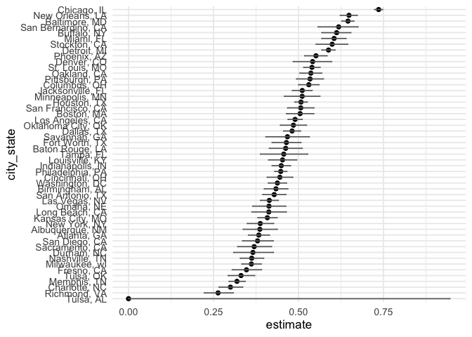

p8105_hw5_yz5248
================
yz5248
2025-11-02

# Problem 1

``` r
birthdays = sample(1:365, 5, replace = TRUE)

repeated_bday = length(unique(birthdays)) < 5
repeated_bday
```

    ## [1] FALSE

``` r
bday_sim = function(n_room){
  birthdays = sample(1:365, n_room, replace = TRUE)
  
  repeated_bday = length(unique(birthdays)) < n_room
  repeated_bday
}
```

``` r
bday_sim_results =
  expand_grid(
    bdays = 2:50,
    iter = 1:10000
  ) |>
  mutate(
    result = map_lgl(bdays, bday_sim)
  ) |>
  group_by(
    bdays
  ) |>
  summarise(
    prob_repeat = mean(result)
  )
```

``` r
bday_sim_results |>
  ggplot(aes(x = bdays, y = prob_repeat)) + 
  geom_point() +
  geom_line()
```

<!-- -->

``` r
bday_sim_results
```

    ## # A tibble: 49 × 2
    ##    bdays prob_repeat
    ##    <int>       <dbl>
    ##  1     2      0.003 
    ##  2     3      0.0087
    ##  3     4      0.0172
    ##  4     5      0.0286
    ##  5     6      0.0399
    ##  6     7      0.0544
    ##  7     8      0.0757
    ##  8     9      0.097 
    ##  9    10      0.118 
    ## 10    11      0.141 
    ## # ℹ 39 more rows

The simulation plot demonstrates that as group size increases, the
probability of shared birthdays grows rapidly, reaching about 50% around
23 people and approaching 100% by 50 people — a clear empirical
verification of the birthday paradox.

# Problem 2

``` r
one_sample_sim = function(mu, sigma = 5, n_subj = 30, n_sim = 5000, conf_level = 0.95) {
  sim_df = replicate(n_sim, {
    x = rnorm(n_subj, mean = mu, sd = sigma)
    test_result = t.test(x, mu = 0, conf.level = conf_level)
    tidy_res = broom::tidy(test_result)
    tibble(
      mu_hat = mean(x),
      p_value = tidy_res$p.value
    )
  }, 
  simplify = FALSE)
  
  bind_rows(sim_df)
}
```

``` r
sim_results_df =
  expand_grid(
    mu = 0:6,
    iter = 1:5
  ) |> 
  mutate(
    results = map(mu, one_sample_sim)
  ) |> 
  unnest(results) |> 
  group_by(mu) |> 
  summarise(
    power = mean(p_value < 0.05),
    mean_mu_hat = mean(mu_hat),
    mean_mu_hat_reject = mean(mu_hat[p_value < 0.05])
  )
sim_results_df
```

    ## # A tibble: 7 × 4
    ##      mu  power mean_mu_hat mean_mu_hat_reject
    ##   <int>  <dbl>       <dbl>              <dbl>
    ## 1     0 0.0490     0.00357            -0.0713
    ## 2     1 0.183      0.991               2.24  
    ## 3     2 0.561      2.00                2.62  
    ## 4     3 0.888      3.00                3.19  
    ## 5     4 0.987      4.00                4.03  
    ## 6     5 1.00       5.00                5.01  
    ## 7     6 1          6.00                6.00

## plot 1

``` r
p_power = sim_results_df |>
  ggplot(aes(x = mu, y = power)) +
  geom_line() +
  geom_point()
p_power
```

<!-- --> The
plot shows a positive association between effect size and power:  
As effect size increases, the power of the test also increases.  
When effect size equals to 0 the power is very low (close to the
significance level, around 0.05–0.1), meaning the test rarely rejects
the null hypothesis when it is true.  
As effect size increases to about 2, the power rises sharply (around
0.5), indicating the test becomes more capable of detecting the
effect.  
\## plot 2

``` r
estimate_mu = sim_results_df |>
  ggplot(aes(x = mu)) + 
  geom_line(aes(y = mean_mu_hat, color = "All samples")) +
  geom_point(aes(y = mean_mu_hat, color = "All samples")) +
  geom_line(aes(y = mean_mu_hat_reject, color = "Rejected samples")) +
  geom_point(aes(y = mean_mu_hat_reject, color = "Rejected samples")) 

estimate_mu
```

<!-- -->
From the plot, we could find that the blue line is systematically higher
than the red line for small mu values. The average mu across all samples
is approximately unbiased for the true mu, but the average mu among
samples where the null is rejected is biased upward, especially for
small mu. This happens because we condition on a rare event (rejection),
which tends to occur when the observed effect size is large —
demonstrating selection bias in inference after testing.

# Problem 3

``` r
homicides_df = read_csv("homicide-data.csv")
```

    ## Rows: 52179 Columns: 12
    ## ── Column specification ────────────────────────────────────────────────────────
    ## Delimiter: ","
    ## chr (9): uid, victim_last, victim_first, victim_race, victim_age, victim_sex...
    ## dbl (3): reported_date, lat, lon
    ## 
    ## ℹ Use `spec()` to retrieve the full column specification for this data.
    ## ℹ Specify the column types or set `show_col_types = FALSE` to quiet this message.

The dataset compiled by The Washington Post contains detailed
information on homicides that occurred in 50 of the largest U.S. cities
between January 1, 2007, and December 31, 2017. Each row in the dataset
represents a single homicide case. The data were collected from local
police departments and publicly available police records, and later
curated by The Washington Post for public use.  
The dataset contains variables: “uid”, “reported_date”, “victim_last”,
“victim_first”, “victim_race”, “victim_age”, “victim_sex”, “city”,
“state”, “lat”, “lon”, “disposition”

``` r
city_state = homicides_df |>
  mutate(
    city_state = str_c(city, ", ", state),
    unsolved = if_else(
      disposition %in% c("Closed without arrest", "Open/No arrest"),
      1, 0
    )
  ) |>
  group_by(city_state) |>
  summarise(
    total_homicides = n(),
    unsolved_homicides = sum(unsolved),
    .groups = "drop"
  ) |>
  view()
```

``` r
baltimore_df = city_state |>
  filter(city_state == "Baltimore, MD")

baltimore_test = prop.test(
  x = baltimore_df$unsolved_homicides,
  n = baltimore_df$total_homicides
) 
baltimore_test
```

    ## 
    ##  1-sample proportions test with continuity correction
    ## 
    ## data:  baltimore_df$unsolved_homicides out of baltimore_df$total_homicides, null probability 0.5
    ## X-squared = 239.01, df = 1, p-value < 2.2e-16
    ## alternative hypothesis: true p is not equal to 0.5
    ## 95 percent confidence interval:
    ##  0.6275625 0.6631599
    ## sample estimates:
    ##         p 
    ## 0.6455607

``` r
baltimore_table = baltimore_test |>
  broom::tidy()
baltimore_table
```

    ## # A tibble: 1 × 8
    ##   estimate statistic  p.value parameter conf.low conf.high method    alternative
    ##      <dbl>     <dbl>    <dbl>     <int>    <dbl>     <dbl> <chr>     <chr>      
    ## 1    0.646      239. 6.46e-54         1    0.628     0.663 1-sample… two.sided

``` r
city_results = 
  city_state |>
  mutate(
    test_result = map2(unsolved_homicides, total_homicides, ~prop.test(.x, .y))
  )
```

    ## Warning: There was 1 warning in `mutate()`.
    ## ℹ In argument: `test_result = map2(unsolved_homicides, total_homicides,
    ##   ~prop.test(.x, .y))`.
    ## Caused by warning in `prop.test()`:
    ## ! Chi-squared approximation may be incorrect

``` r
city_results_tidy = 
  city_results |>
  mutate(
    tidy_res = map(test_result, broom::tidy)
  ) |>
  unnest(tidy_res) |> 
  select(city_state, total_homicides, unsolved_homicides, estimate, conf.low, conf.high)
city_results_tidy
```

    ## # A tibble: 51 × 6
    ##    city_state     total_homicides unsolved_homicides estimate conf.low conf.high
    ##    <chr>                    <int>              <dbl>    <dbl>    <dbl>     <dbl>
    ##  1 Albuquerque, …             378                146    0.386    0.337     0.438
    ##  2 Atlanta, GA                973                373    0.383    0.353     0.415
    ##  3 Baltimore, MD             2827               1825    0.646    0.628     0.663
    ##  4 Baton Rouge, …             424                196    0.462    0.414     0.511
    ##  5 Birmingham, AL             800                347    0.434    0.399     0.469
    ##  6 Boston, MA                 614                310    0.505    0.465     0.545
    ##  7 Buffalo, NY                521                319    0.612    0.569     0.654
    ##  8 Charlotte, NC              687                206    0.300    0.266     0.336
    ##  9 Chicago, IL               5535               4073    0.736    0.724     0.747
    ## 10 Cincinnati, OH             694                309    0.445    0.408     0.483
    ## # ℹ 41 more rows

``` r
city_results_tidy |>
  mutate(
    city_state = fct_reorder(city_state, estimate)
  ) |>
  ggplot(aes(x = estimate, y = city_state)) +
  geom_point() +
  geom_errorbar(
    aes(xmin = conf.low, xmax = conf.high),
    width = 0.2, color = "gray40"
  ) +
  theme_minimal(base_size = 13)
```

<!-- -->
