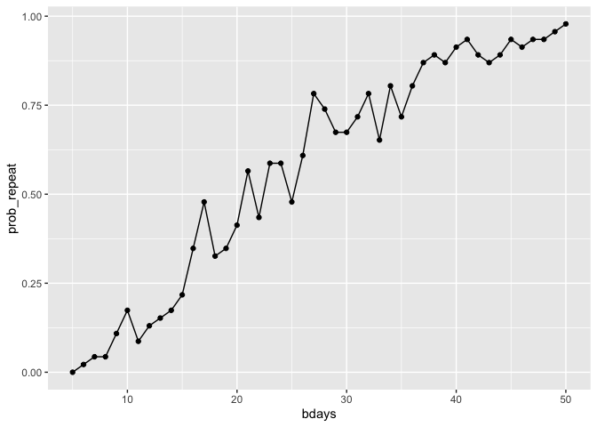
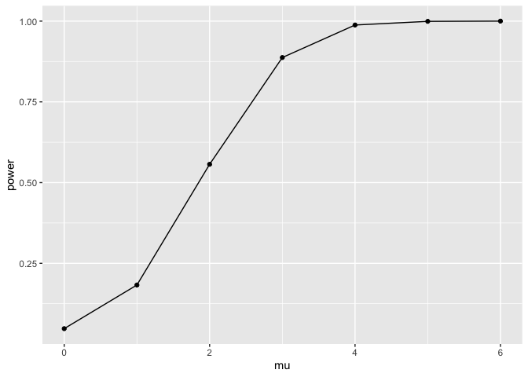
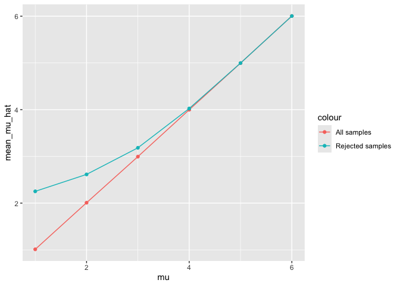

p8105_hw5_yz5248
================
yz5248
2025-11-02

# Problem 1

``` r
birthdays = sample(1:365, 5, replace = TRUE)

repeated_bday = length(unique(birthdays)) < 5
repeated_bday
```

    ## [1] FALSE

``` r
bday_sim = function(n_room){
  birthdays = sample(1:365, n_room, replace = TRUE)
  
  repeated_bday = length(unique(birthdays)) < n_room
  repeated_bday
}
```

``` r
bday_sim_results =
  expand_grid(
    bdays = 5:50,
    iter = 5:50
  ) |>
  mutate(
    result = map_lgl(bdays, bday_sim)
  ) |>
  group_by(
    bdays
  ) |>
  summarise(
    prob_repeat = mean(result)
  )
```

``` r
bday_sim_results |>
  ggplot(aes(x = bdays, y = prob_repeat)) + 
  geom_point() +
  geom_line()
```

<!-- -->

# Problem 2

``` r
one_sample_sim = function(mu, sigma = 5, n_subj = 30, n_sim = 5000, conf_level = 0.95) {
  sim_df = replicate(n_sim, {
    x = rnorm(n_subj, mean = mu, sd = sigma)
    test_result = t.test(x, mu = 0, conf.level = conf_level)
    tidy_res = broom::tidy(test_result)
    tibble(
      mu_hat = mean(x),
      p_value = tidy_res$p.value
    )
  }, 
  simplify = FALSE)
  
  bind_rows(sim_df)
}
```

``` r
sim_results_df =
  expand_grid(
    mu = 0:6,
    iter = 1:5
  ) |> 
  mutate(
    results = map(mu, one_sample_sim)
  ) |> 
  unnest(results) |> 
  group_by(mu) |> 
  summarise(
    power = mean(p_value < 0.05),
    mean_mu_hat = mean(mu_hat),
    mean_mu_hat_reject = mean(mu_hat[p_value < 0.05])
  )

sim_results_df
```

    ## # A tibble: 7 × 4
    ##      mu  power mean_mu_hat mean_mu_hat_reject
    ##   <int>  <dbl>       <dbl>              <dbl>
    ## 1     0 0.0486    -0.00174            0.00831
    ## 2     1 0.186      1.00               2.26   
    ## 3     2 0.560      1.99               2.61   
    ## 4     3 0.889      3.00               3.19   
    ## 5     4 0.989      4.00               4.03   
    ## 6     5 1.00       5.00               5.01   
    ## 7     6 1.00       6.00               6.00

## plot 1

``` r
p_power = sim_results_df |>
  ggplot(aes(x = mu, y = power)) +
  geom_line() +
  geom_point()
p_power
```

<!-- -->

## plot 2

``` r
estimate_mu = sim_results_df |>
  ggplot(aes(x = mu)) + 
  geom_line(aes(y = mean_mu_hat, color = "All samples")) +
  geom_point(aes(y = mean_mu_hat, color = "All samples")) +
  geom_line(aes(y = mean_mu_hat_reject, color = "Rejected samples")) +
  geom_point(aes(y = mean_mu_hat_reject, color = "Rejected samples")) 

estimate_mu
```

<!-- -->

# Problem 3

``` r
homicides_df = read_csv("homicide-data.csv")
```

    ## Rows: 52179 Columns: 12
    ## ── Column specification ────────────────────────────────────────────────────────
    ## Delimiter: ","
    ## chr (9): uid, victim_last, victim_first, victim_race, victim_age, victim_sex...
    ## dbl (3): reported_date, lat, lon
    ## 
    ## ℹ Use `spec()` to retrieve the full column specification for this data.
    ## ℹ Specify the column types or set `show_col_types = FALSE` to quiet this message.

The dataset contains variables: “uid”, “reported_date”, “victim_last”,
“victim_first”, “victim_race”, “victim_age”, “victim_sex”, “city”,
“state”, “lat”, “lon”, “disposition”

``` r
city_state = homicides_df |>
  mutate(
    city_state = str_c(city, ", ", state),
    unsolved = if_else(
      disposition %in% c("Closed without arrest", "Open/No arrest"),
      1, 0
    )
  ) |>
  group_by(city_state) |>
  summarise(
    total_homicides = n(),
    unsolved_homicides = sum(unsolved),
    .groups = "drop"
  ) |>
  view()
```
